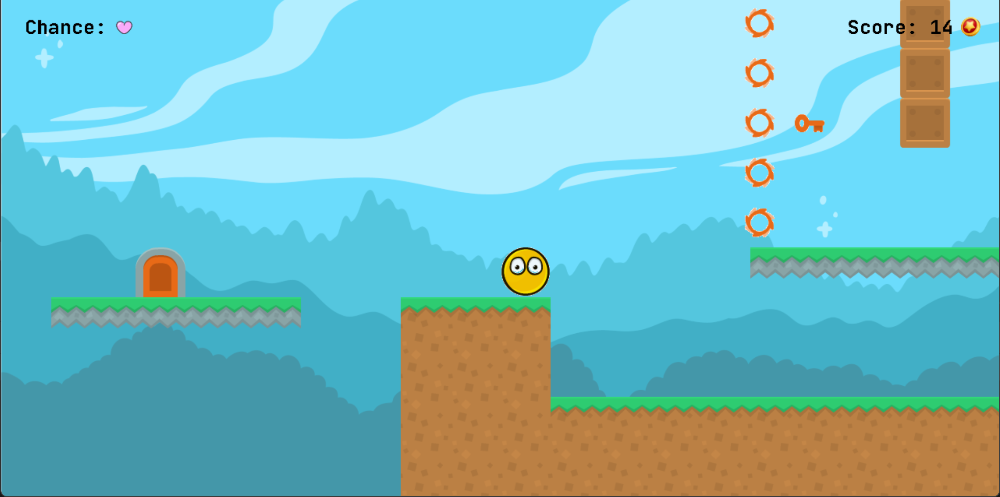

# Bouncing Bubu

Khuất Tuấn Anh - MSV 22028248

[Link video demo game](https://youtu.be/TT6F9214kWY)

## Giới thiệu game

*Bouncing Bubu* là một trò chơi hành động thú vị và đầy thử thách, nơi bạn điều khiển nhân vật chính, Bubu, một quả bóng dễ thương có khả năng nhảy nhót không ngừng. Nhiệm vụ của bạn là giúp Bubu vượt qua các chướng ngại vật và thu thập các đồng xu để đạt điểm cao nhất.

## Cách tải game

#### Cách 1: Không bao gồm code.
Tải game (được nén thành .zip) đường link sau: (hiện đang update)

#### Cách 2: Bao gồm code và có thể biên dịch.
* Bước 1: Sao chép (Clone) Repository
* Bước 2: Chạy file “Game_LTNC.exe” trong thư mục “cmake-build-debug”

## Giao diện trò chơi

## Các thành phần trong game

- **Map Tile** là các khối nền tảng tạo nên bản đồ của game. Mỗi màn chơi được xây dựng từ các ô vuông nhỏ (tiles), sắp xếp lại với nhau để tạo thành các địa hình và đường đi mà Bubu phải vượt qua.

- **Coin (đồng xu)** là những đồng xu mà Bubu có thể thu thập trong suốt quá trình chơi. Thu thập coin giúp người chơi ghi điểm.

- **Trap (Bẫy)** là các chướng ngại vật nguy hiểm mà Bubu phải tránh trong quá trình di chuyển. Bẫy có thể bao gồm gai nhọn, lửa, hoặc các hố sâu, và chúng thường được đặt ở những vị trí bất ngờ để tăng độ khó của game. Chạm vào bẫy có thể khiến Bubu mất mạng hoặc phải quay lại một điểm lưu (checkpoint) gần nhất.

- **Door (Cánh cửa)** là điểm cuối cùng của mỗi màn chơi. Mục tiêu của người chơi là đưa Bubu đến cửa này để kết thúc màn chơi và dành chiến thắng. Cửa có thể yêu cầu Bubu phải thu thập một số lượng key nhất định trước khi có thể mở.

- **Key (chìa khóa)** là vật phẩm mà người chơi cần thu thập để mở các cánh cửa.

- **Main Character (Bubu)** một quả bóng nhỏ với khả năng nhảy cao và di chuyển nhanh nhẹn. Nhiệm vụ của người chơi là điều khiển Bubu vượt qua các chướng ngại vật, thu thập coin, key, và cuối cùng là tìm đường đến cửa để hoàn thành màn chơi. Bubu có thể nhảy lên các map tile, tránh các bẫy, và thực hiện các thao tác khéo léo để đạt được mục tiêu.

## Cách chơi

#### Sử Dụng Các Phím Mũi Tên Để Di Chuyển Nhân Vật

Nhấn các phím mũi tên **lên**, **trái**, và **phải** để di chuyển nhân vật của bạn trong thế giới game. Mỗi phím sẽ tương ứng với một hướng di chuyển, giúp bạn điều khiển nhân vật đi qua các chướng ngại vật và tiến gần hơn đến mục tiêu của mình.

#### Thu Thập Các Đồng Xu

Trong suốt hành trình, bạn sẽ bắt gặp rất nhiều đồng xu được rải rác khắp nơi. Hãy thu thập càng nhiều đồng xu càng tốt, bởi vì chúng không chỉ giúp tăng điểm số mà còn có thể mang lại những phần thưởng bất ngờ. Đồng xu có thể nằm ở những vị trí khó tiếp cận, yêu cầu bạn phải khéo léo di chuyển hoặc vượt qua các chướng ngại vật để thu thập được chúng.

#### Tránh Va Chạm Và Đừng Để Rơi Xuống Hố

Trên đường đi, bạn sẽ đối mặt với rất nhiều cạm bẫy và hố sâu nguy hiểm. Nếu vô tình rơi vào bẫy hoặc hố, bạn có thể mất mạng hoặc bị buộc phải quay lại điểm xuất phát. Hãy chú ý quan sát môi trường xung quanh và tính toán kỹ lưỡng từng bước đi để tránh những mối nguy hiểm này. Việc di chuyển chính xác và nhanh nhẹn là chìa khóa để vượt qua những thử thách này.

#### Tìm Chìa Khóa Và Mở Cánh Cửa Thần Kỳ Để Chiến Thắng

Mục tiêu cuối cùng của bạn là tìm ra chiếc chìa khóa ẩn giấu trong game. Chiếc chìa khóa này có thể được đặt ở một vị trí khó tìm hoặc bị bảo vệ bởi những cạm bẫy phức tạp. Sau khi tìm được chìa khóa, bạn cần sử dụng nó để mở cánh cửa thần kỳ. Cánh cửa này sẽ dẫn bạn đến màn chơi tiếp theo hoặc giúp bạn chiến thắng trò chơi. Hãy tận dụng mọi kỹ năng và chiến lược của mình để chinh phục thử thách và giành chiến thắng cuối cùng.

#### Lưu ý
- Bạn sẽ chiến thắng nếu lấy được chìa khóa và mở cánh cửa tương ứng
- Bạn sẽ thua cuộc nếu bị rơi xuống hố hoặc va chạm với vật cản 3 lần

## Nguồn tham khảo và tài nguyên

### Đồ họa, hình ảnh

- Nhân vật chính (Bubu) được chỉnh sửa lại dựa trên hình ảnh gốc: [itcho.io](https://gamedeveloperstudio.itch.io/cartoon-balls)
- Các ô (tile) trong bản đồ: [kenny.nl](https://kenney.nl/assets/platformer-pack-redux)
- Hình nền (Background): [freepik.com](https://www.freepik.com/free-vector/hand-drawn-video-game-background_40484419.htm#fromView=search&page=2&position=15&uuid=ef9a86d2-d351-40c5-beb2-28cbb2c24ee3)
- Các icon, hình ảnh được dùng trong mục How To Play: [flaticon.com](https://flaticon.com/)
- Font chữ [Jetbrain Mono](https://fonts.google.com/specimen/JetBrains+Mono) và [Starborn](https://www.dafont.com/starborn.font)

### Âm thanh
- Sound lấy trên kênh youtube [@heyitscriz](https://www.youtube.com/@heyitscriz)

### Mã nguồn tham khảo

[phattrienphanmem123az.com](https://phattrienphanmem123az.com/lap-trinh-game-c-p2)
